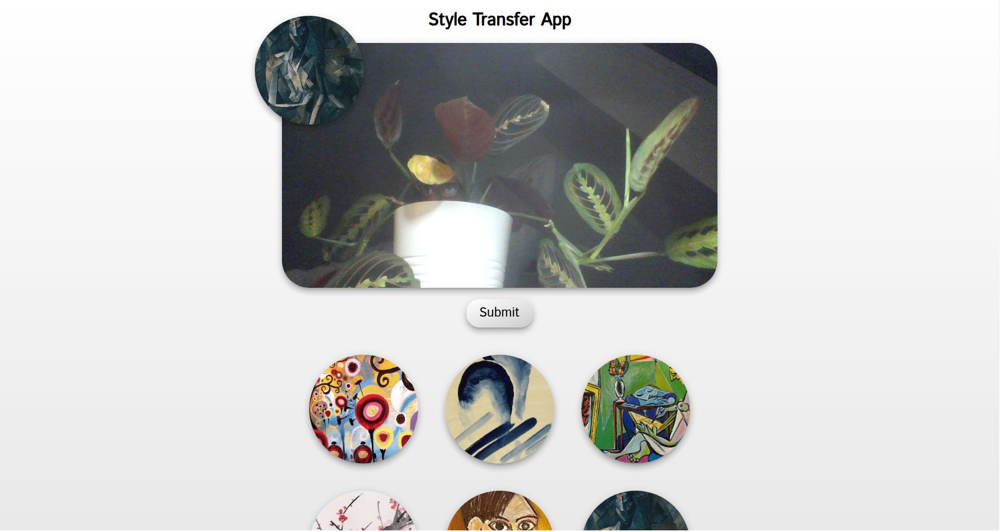
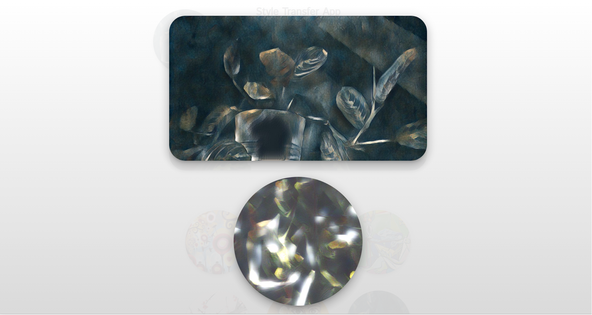

# Style-Transfer-App by Avatar-Net

Simple web app which allows the user to take a photo with the webcam and apply style transfer to it. 
Avatar-Net is used for style transfer, see:
[__Avatar-Net: Multi-scale Zero-shot Style Transfer by Feature Decoration__](https://arxiv.org/abs/1805.03857)

The app is written in Python using Flask, Javascript, HTML and CSS.

## Requirements
The app was tested on Ubuntu 22.04 with Chrome browser (v120.0.6099.71) and a decent GPU (Nvidia GeForce RTX 2080 Ti).

## Installation
- Download pre-trained Avatar-Net from [Google Drive](https://drive.google.com/open?id=1_7x93xwZMhCL-kLrz4B2iZ01Y8Q7SlTX) into `CHECKPOINT_DIR` directory
- Clone the repository and `cd style-transfer-app`
- Create conda environment with required packages: `conda env create -f environment.yaml`
- Activate the environment: `conda activate style-transfer-app`
- (Optional) Test if inference works:
  `python evaluate_style_transfer.py --checkpoint_dir=CHECKPOINT_DIR/model.ckpt-120000 --model_config_path=configs/AvatarNet_config.yml --content_dataset_dir=./data/contents/images/ --style_dataset_dir=./images --eval_dir=./results --inter_weight=0.8`
- Generate self-signed certificate for SSL, so that Chrome allows you to access the camera:
```bash
openssl req -new -key server.key -out server.csr
cp server.key server.key.org
openssl rsa -in server.key.org -out server.key
openssl x509 -req -days 365 -in server.csr -signkey server.key -out server.crt
```
- Run the app: `python server.py --checkpoint_dir=CHECKPOINT_DIR/model.ckpt-120000 --model_config_path=configs/AvatarNet_config.yml --inter_weight=0.8`
  where `--inter_weight` is the blending weight between the content and style
- Open Chrome, go to `https://localhost:8888` and enjoy!

## Usage
- Click on the webcam stream to capture a photo
- Click on the style image to change the style
- Click 'Submit' to send the photos to the server and apply style transfer
- The server returns 2 images: 1) the webcam image styled with the style image and 2) the style image styled with the webcam image (see below)
- All generated images can be found in the `output` directory

  